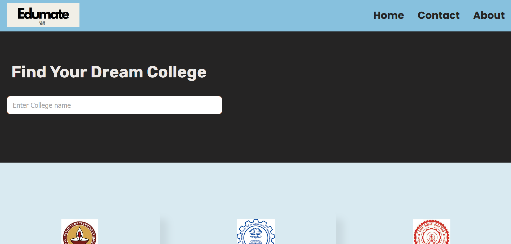
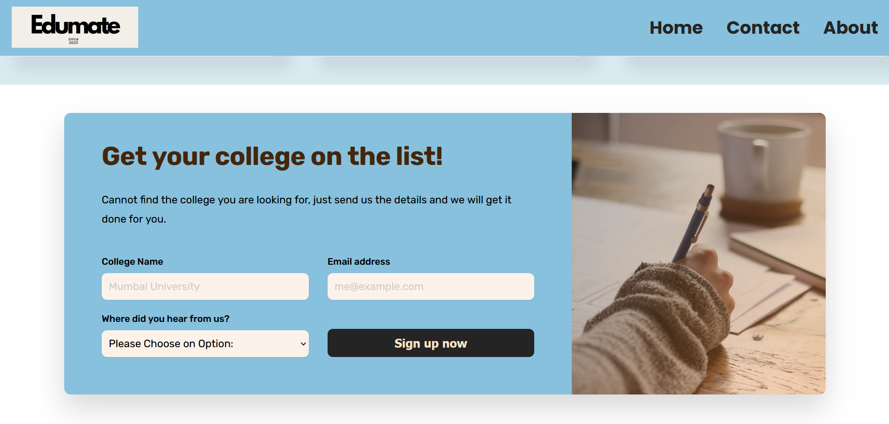

# [Edumate](https://animiiexe.github.io/Edumate/Edumate/index.html)

## Table of Contents
1. [Introduction](#introduction)
2. [Features](#features)
3. [Installation](#installation)
4. [Usage](#usage)
5. [Screenshots](#screenshots)
6. [Contributing](#contributing)
7. [License](#license)

## Introduction
Welcome to the College Portal project! This application allows users to view details about various colleges and add new colleges to the list. It is built using HTML, CSS, and JavaScript, providing a simple and intuitive interface.

## Features
- **View College Details**: Browse through a list of colleges and view detailed information about each one.
- **Add College**: Add new colleges to the list with relevant details.

## Installation
To set up the College Portal project locally, follow these steps:

1. Clone the repository:
    ```sh
    git clone https://github.com/Animiiexe/Edumate.git
    ```

2. Navigate to the project directory:
    ```sh
    cd Edumate
    ```

3. Open the `index.html` file in your browser to start using the application.

No additional setup is required.

## Usage
1. Open the app in your browser by opening the `index.html` file.
2. Use the navigation to:
    - **View Colleges**: Click on the "View Colleges" button to see a list of colleges and their details.
    - **Add College**: Click on the "Add College" button to fill out a form and submit new college details.

## Screenshots

*Home Page*


*View Colleges*


*Add College*

## Contributing
We welcome contributions to improve the College Portal project! To contribute, please follow these steps:

1. Fork the repository.
2. Create a new branch:
    ```sh
    git checkout -b feature-branch
    ```
3. Make your changes and commit them:
    ```sh
    git commit -m "Description of your changes"
    ```
4. Push to the branch:
    ```sh
    git push origin feature-branch
    ```
5. Create a pull request.

## License
This project is licensed under the [Apache 2.0 License](LICENSE) - see the [LICENSE](LICENSE) file for details.

## Badges


